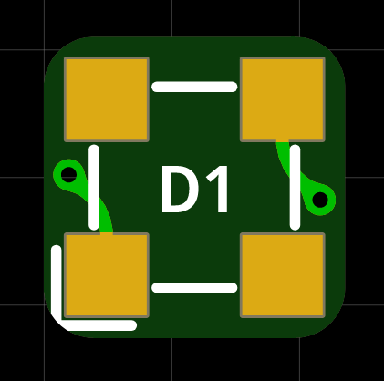
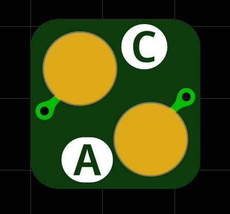

# Tiny 3mm MicroFC SiPM Carrier Board

Tiny carrier board for a 3 mm C-Series MICROFC-60035-SMT silicon photomultiplier by [onsemi](https://www.onsemi.com/pdf/datasheet/microc-series-d.pdf). PCB size is 6 x 6 mm. The solder pads for the SiPM are slightly bigger than they need to so that you can easily hand-solder everything.

  
  

On the front side there is only the sensor itself and the two connections are on the back. This ensures good optical contact and light-tight sealing.

To connect the sensor, solder wires to the anode `A` and cathode `C` pads of the PCB. These are connected straight to the respective pads on the SiPM.

